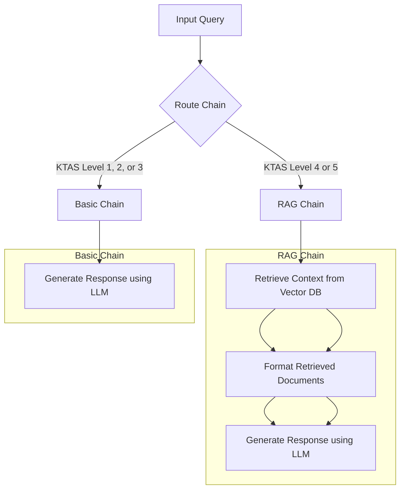

# 응급구조 챗봇

## 사용법
### 1. **Clone the Repository:**
```bash
   git clone https://github.com/seongyeon1/Fraiday.git
   cd Fraiday
```

### 2-1. **Use the `setup.sh` Script**
   ```bash
   git clone https://github.com/seongyeon1/Fraiday.git
   cd Fraiday
```bash
chmod +x setup.sh
./setup.sh
```
`setup.sh` 파일 실행 도중  "Enter your UPSTAGE_API_KEY:"라는 문장이 터미널에서 나오면 upstage_api_key를 입력하면 실행이 된다. 

실행후 http://0.0.0.0:8000/ 에서 결과 확인가능
- http://0.0.0.0:8000/chat/playground : 멀티턴 대화에 능숙한 실제 응급구조 대원과 같이 대화하는 모델
- http://0.0.0.0:8000/main/playground : RAG를 사용하여 응급처치 설명에 익숙하며, KTAS 단계를 알려주고 대화 요약까지 가능한 모델


### 2-2. **Do it step-by-step**
#### 가상환경 만들기
```bash
python -m venv .venv
echo '.venv' >> .gitignore
. .venv/bin/activate
 
pip install --upgrade pip
pip install -r requirements.txt
```

#### .env 파일 만들기
```bash
cat > .env
UPSTAGE_API_KEY='발급 받은 API 입력' #ex) UPSTAGE_API_KEY=up_YW~
```
- 입력후 Ctrl+ C를 통해 cat 명령어를 닫는다

#### 앱 실행
```bash
cd app
python main.py
```

## dir structure

### app
- `main.py` : fastapi, langserve 활용한 메인 페이지
- `chat.py`
  - upstage api 사용해서 프롬프트만 튜닝해서 응급구조 챗봇데모 제작 (고도화 진행중)
  - 멀티턴 대화에 좋은 성능을 보임
  - 실제 응급구조 요원같이 대화하지만 전문적인 지식을 요구할 시 명확한 지식근거가 부족함
 
- `rag.py` : rag 이용 (서울대학교 응급처치)
  - `chat` 페이지보다 전문적인 모델
  - RAG를 사용하여 응급처치 설명에 익숙함
  - KTAS 단계를 알려주고 대화 요약까지 가능한 모델
  - 절차를 따라서 KTAS 단계를 알려주기 떄문에 유연한 대화가 부족함

- `/template` : 프롬프트 템플릿을 저장


## flowchart (발전방향)



### preprocessing
- `ocr.py`
- `chunking.py`
  - RAG를 위한 임베딩과 OCR 처리를 위한 함수
  - 현재는 서울대학교 데이터, 생활응급처치 길라잡이 데이터를 ocr처리하고 embedding하는 데에 사용


## 실행결과
- 멀티턴 대화에 능하다

- 응급처치 방법을 자세하게 잘 알려준다

- KTAS 등급 제시

- 전체 대화를 요약해서 응급실 내원시 보조자료로 활용이 가능하다