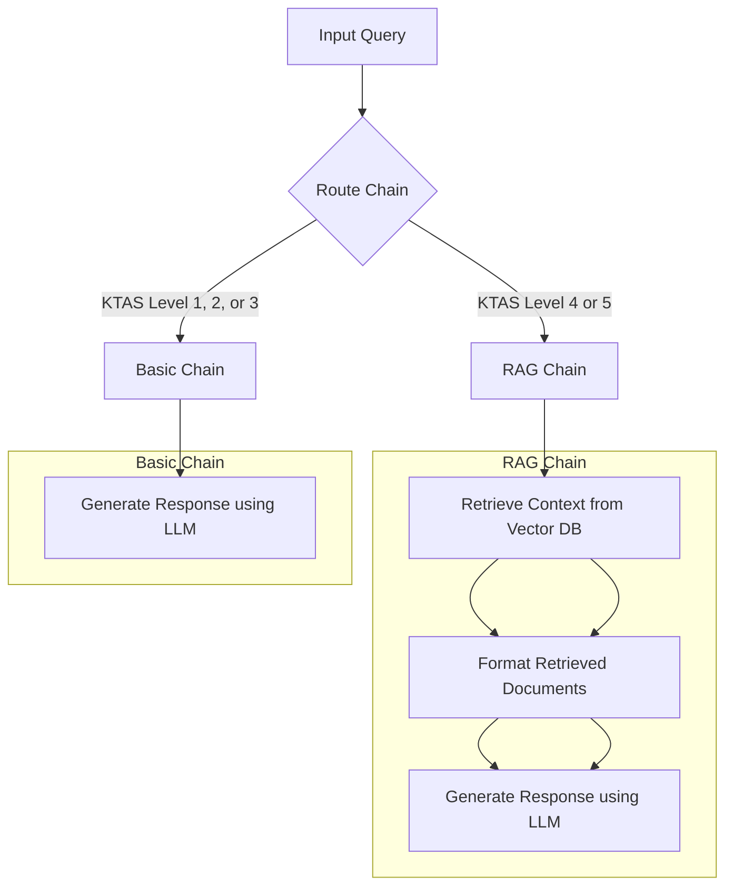

# Emergency Response Chatbot
- if you want to read in KOREAN, click [here](README-ko.md)

## Usage
### 1. **Clone the Repository:**
```bash
git clone https://github.com/seongyeon1/Fraiday.git
cd Fraiday
```

### 2-1. **Use the `setup.sh` Script**
```bash
chmod +x setup.sh
./setup.sh
```
During the execution of the `setup.sh` file,         
when the terminal displays `Enter your UPSTAGE_API_KEY:`, enter your `UPSTAGE_API_KEY` to continue.

    
After execution, you can check the results at http://0.0.0.0:8000/
- http://0.0.0.0:8000/chat/playground 
  - A model that converses like a real emergency responder and excels in multi-turn conversations.
- http://0.0.0.0:8000/main/playground
  - A model that is proficient in explaining first aid using RAG, informs about KTAS levels, and summarizes conversations.

### 2-2. **Do it step-by-step**
#### Create a Virtual Environment
```bash
python -m venv .venv
echo '.venv' >> .gitignore
. .venv/bin/activate

pip install --upgrade pip
pip install -r requirements.txt
```

#### Create a .env File
```bash
cat > .env
UPSTAGE_API_KEY='Your issued API key' # e.g., UPSTAGE_API_KEY=up_YW~
```
- After entering, close the `cat` command using Ctrl+C.

#### Run the App
```bash
cd app
python main.py
```

## Directory Structure

```plaintext
Fraiday
├── app
│   ├── main.py
│   ├── chat.py
│   ├── rag.py
│   └── template
│       └── (prompt templates)
├── preprocessing
│   ├── ocr.py
│   └── chunking.py
├── setup.sh
├── requirements.txt
└── .env(example)
└── .env(example)
```

### app
- `**app/main.py**`: The main page utilizing FastAPI and Langserve.
- `**app/chat.py**`: 
  - Uses the Upstage API to fine-tune prompts for an emergency response chatbot demo (under development).
  - Excels in multi-turn conversations.
  - Chats like a real emergency responder but lacks precise knowledge for professional expertise.
- `**app/rag.py**`: Uses RAG (Seoul National University First Aid).
  - A more specialized model compared to the `chat` page.
  - Proficient in explaining first aid using RAG.
  - Informs about KTAS levels and summarizes conversations.
  - Lacks flexibility in conversations as it follows procedures to inform about KTAS levels.
- `**app/templates**`: Stores prompt templates.

### preprocessing
- `**preprocessing/ocr.py**`
- `**preprocessing/chunking.py**`
  - Functions for embedding and OCR processing for RAG.
  - Currently used for OCR processing and embedding Seoul National University data and the First Aid Guidebook.

## Flowchart (Future Direction)



## Execution Results
- Excels in multi-turn conversations.
- Provides detailed explanations of first aid methods.
- Informs about KTAS levels.
- Summarizes the entire conversation for use as supplementary material when visiting the emergency room.